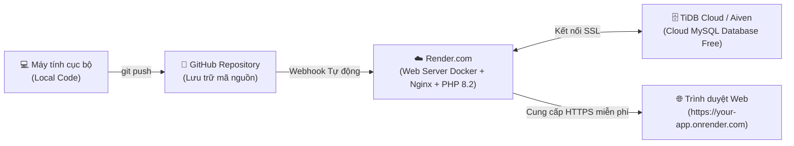

# 🚀 HƯỚNG DẪN TRIỂN KHAI ỨNG DỤNG LÊN WEB (GITHUB + RENDER + CLOUD MYSQL)

Tài liệu hướng dẫn chi tiết quy trình đưa Hệ Thống Lịch Giảng Dạy & Sổ Tay Giáo Án lên Internet hoàn toàn **Miễn Phí (100% Free)** và bảo mật.

---

## 🏗️ 1. MÔ HÌNH KIẾN TRÚC TRIỂN KHAI



- **Mã nguồn:** Quản lý tập trung trên **GitHub** (riêng tư hoặc công khai).
- **Máy chủ Web (Web Hosting):** Chạy trên **Render.com** thông qua Dockerfile tối ưu hóa cao (PHP 8.2 + Nginx + PhpWord + Opcache).
- **Cơ sở dữ liệu (Database):** Lưu trên **TiDB Cloud Serverless** (hoàn toàn tương thích MySQL 8.0, 5GB lưu trữ miễn phí vĩnh viễn, đặt tại Singapore tốc độ cao).

---

## 📋 2. CÁC BƯỚC THỰC HIỆN CHI TIẾT (STEP-BY-STEP)

### BƯỚC 1: ĐẨY MÃ NGUỒN LÊN GITHUB
1. Mở trình duyệt, truy cập [https://github.com/new](https://github.com/new) và tạo một Repository mới (đặt tên ví dụ: `teaching-schedule-app`, chọn chế độ **Private** hoặc **Public**).
2. Mở Terminal tại thư mục dự án và chạy các lệnh sau (thay thế URL bằng link repository của Thầy):
   ```bash
   git remote add origin https://github.com/USERNAME/teaching-schedule-app.git
   git branch -M main
   git push -u origin main
   ```

---

### BƯỚC 2: TẠO CƠ SỞ DỮ LIỆU MYSQL CLOUD MIỄN PHÍ (TIDB CLOUD)
1. Truy cập [https://tidbcloud.com](https://tidbcloud.com) và bấm **Sign In with GitHub** (hoặc Google).
2. Nhấn nút **Create Cluster** (hoặc Create Database).
3. Chọn gói **Serverless (Free $0/month)**.
4. Chọn vùng (Region): **Singapore (ap-southeast-1)** để đạt tốc độ truy xuất nhanh nhất về Việt Nam.
5. Nhập tên Cluster (ví dụ: `teaching-cluster`) và nhấn **Create**.
6. Sau khi khởi tạo xong (mất khoảng 10 giây), nhấn nút **Connect** ở góc phải:
   - Nhấn **Create Password** để sinh mật khẩu ngẫu nhiên cho user `root`. Hãy lưu lại mật khẩu này!
   - Tại mục **Connect with**, chọn **General** hoặc **Laravel**.
   - Thầy sẽ nhìn thấy các thông số:
     - **Host:** Ví dụ `gateway01.ap-southeast-1.prod.aws.tidbcloud.com`
     - **Port:** `4000`
     - **User:** Ví dụ `xxxxxx.root`
     - **Database:** `teaching_schedule` (nếu chưa có database, hệ thống sẽ tự động tạo khi chạy migration).

---

### BƯỚC 3: KẾT NỐI VÀ TRIỂN KHAI TRÊN RENDER.COM
1. Truy cập [https://render.com](https://render.com) và đăng nhập bằng tài khoản **GitHub**.
2. Tại bảng điều khiển Render, nhấn **New +** ở góc trên bên phải -> Chọn **Web Service**.
3. Chọn repository `teaching-schedule-app` của Thầy và nhấn **Connect**.
4. Điền các thông tin cấu hình cơ bản:
   - **Name:** `teaching-schedule-app` (hoặc tên tuỳ thích, đây sẽ là đường dẫn web: `ten-ung-dung.onrender.com`).
   - **Region:** **Singapore** (trùng với cụm Database).
   - **Runtime:** **Docker** (Render sẽ tự động đọc tệp `Dockerfile` đã chuẩn bị sẵn).
   - **Instance Type:** **Free** ($0/tháng).

---

### BƯỚC 4: THIẾT LẬP BIẾN MÔI TRƯỜNG (ENVIRONMENT VARIABLES)
Cuộn xuống phần **Environment Variables** trên Render và nhấn **Add Environment Variable** để thêm các giá trị sau:

| Tên biến (Key) | Giá trị mẫu (Value) | Ghi chú |
| :--- | :--- | :--- |
| `APP_NAME` | `Hệ Thống Lịch Giảng Dạy` | Tên hiển thị ứng dụng |
| `APP_ENV` | `production` | Chế độ chạy thực tế |
| `APP_DEBUG` | `false` | Tắt chế độ gỡ lỗi để bảo mật |
| `APP_KEY` | *(Bấm Generate trên Render hoặc copy từ file .env local)* | Khóa mã hóa session |
| `DB_CONNECTION` | `mysql` | Loại kết nối CSDL |
| `DB_HOST` | `gateway01.ap-southeast-1.prod.aws.tidbcloud.com` | Lấy từ Bước 2 |
| `DB_PORT` | `4000` | Port của TiDB Cloud (mặc định 4000) |
| `DB_DATABASE` | `teaching_schedule` | Tên cơ sở dữ liệu |
| `DB_USERNAME` | `xxxxxx.root` | Lấy từ Bước 2 |
| `DB_PASSWORD` | `[Mật khẩu lấy từ Bước 2]` | Lấy từ Bước 2 |
| `MYSQL_ATTR_SSL_CA` | `/etc/ssl/certs/ca-certificates.crt` | Kích hoạt chứng chỉ SSL an toàn |
| `SESSION_DRIVER` | `database` | Lưu phiên người dùng vào CSDL |
| `FILESYSTEM_DISK` | `local` | Lưu trữ file trên container |
| `LOG_CHANNEL` | `stderr` | Hiển thị log ra màn hình Render |

Sau đó nhấn nút **Create Web Service** (hoặc **Deploy**).

---

### BƯỚC 5: KHỞI TẠO DỮ LIỆU BAN ĐẦU & NGHIỆM THU
1. **Theo dõi tiến trình Build:**
   - Render sẽ tự động kéo mã nguồn từ GitHub, build Docker container, cài đặt các extension PHP, tải thư viện Composer và tự động chạy `php artisan migrate --force`.
   - Khi màn hình hiển thị: `Your service is live 🎉`, ứng dụng đã chính thức online!
2. **Khởi tạo dữ liệu mẫu (Seeder):**
   - Trên trang quản trị Web Service của Render, chọn tab **Shell**.
   - Gõ lệnh sau để nạp dữ liệu các môn học và lịch mẫu:
     ```bash
     php artisan db:seed --force
     ```
3. **Trải nghiệm ứng dụng:**
   - Nhấp vào đường dẫn web ở góc trái trên (ví dụ: `https://teaching-schedule-app.onrender.com`).
   - Thầy có thể mở và sử dụng đầy đủ các tính năng:
     - Lập kế hoạch giảng dạy, xếp lịch tự động.
     - Đồng bộ Google Calendar.
     - Xuất file Word Kế hoạch giảng dạy Mẫu số 8.
     - Xuất trọn bộ Sổ Giáo Án Mẫu 9c chuẩn OpenXML.
     - Tải trọn gói ZIP từng buổi giáo án (`[tenlop]-[mamon].zip`).

---

## 🔄 CƠ CHẾ CẬP NHẬT TỰ ĐỘNG (CI/CD)
Sau này, mỗi khi Thầy sửa code hoặc nâng cấp tính năng mới ở máy tính, Thầy chỉ cần chạy:
```bash
git add .
git commit -m "Cập nhật tính năng..."
git push origin main
```
Render sẽ **tự động nhận diện** và tiến hành build lại bản mới nhất trong vòng 2 phút mà Thầy không cần phải thao tác thủ công gì thêm!
